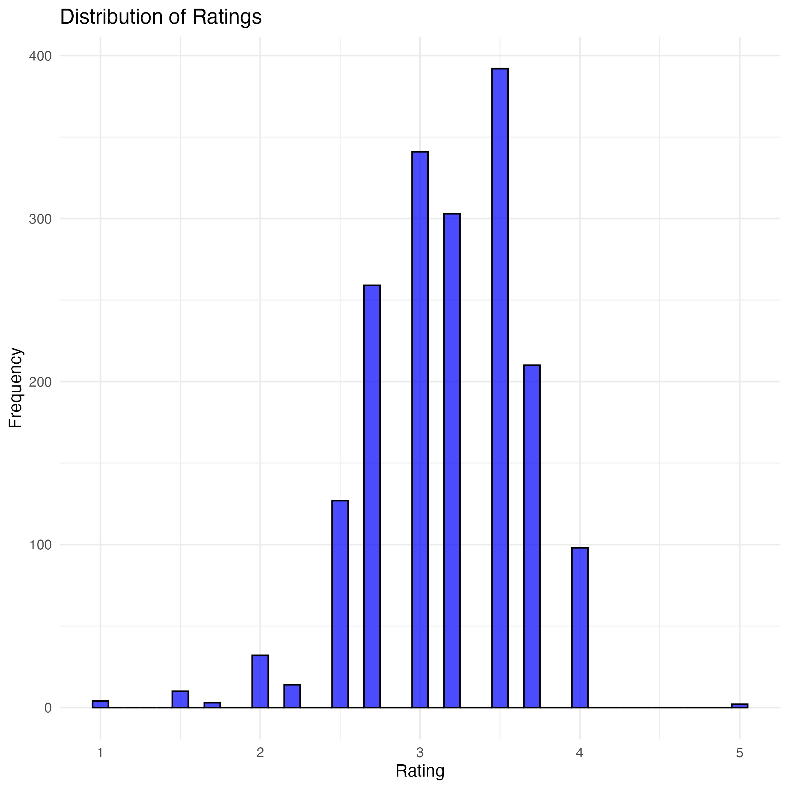
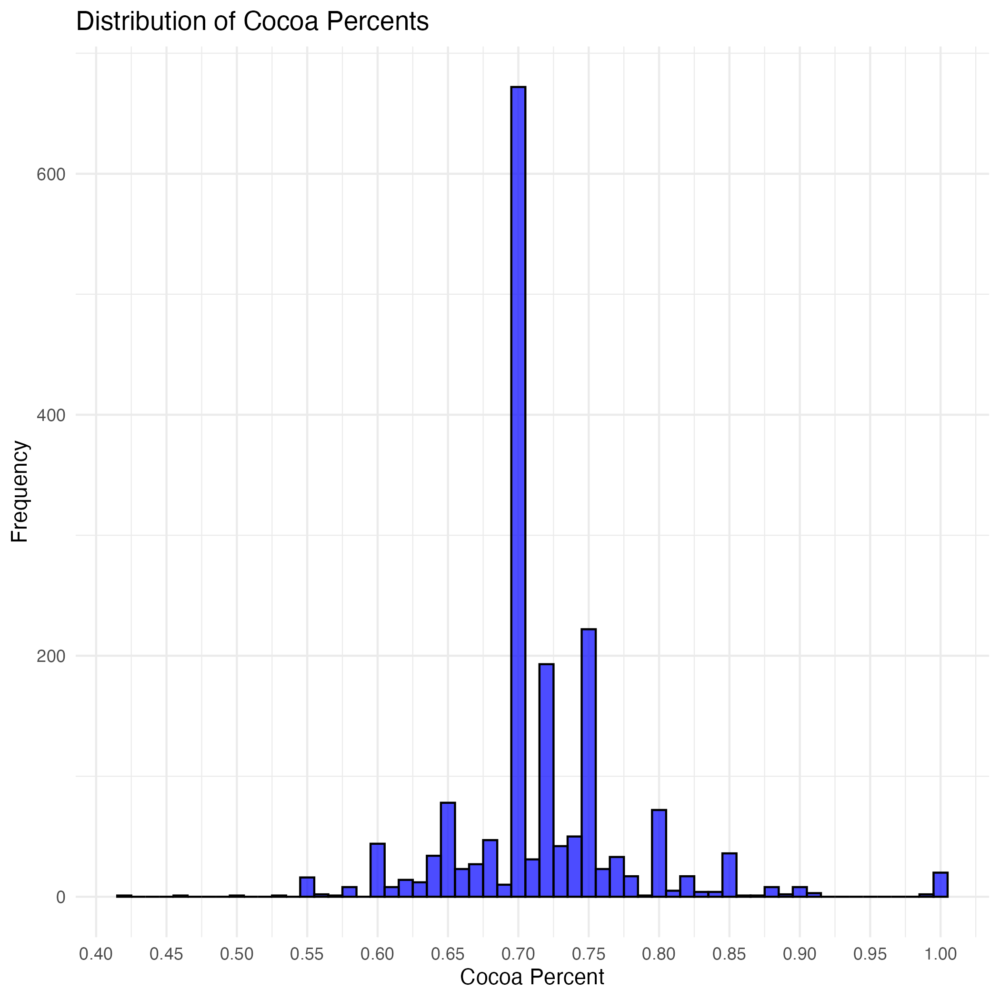
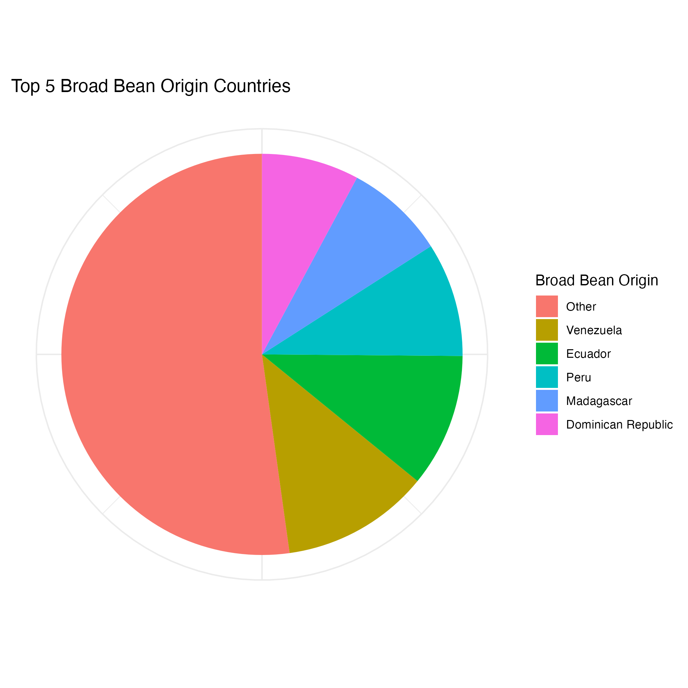
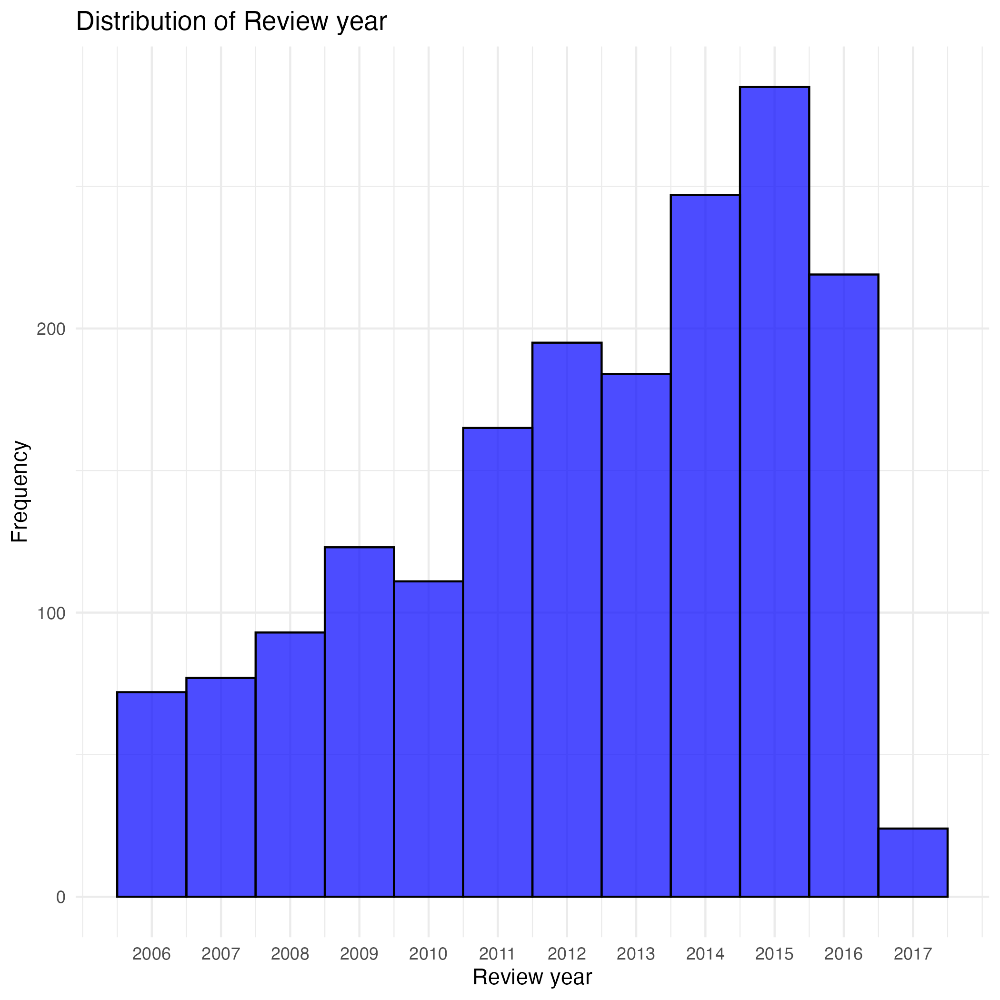
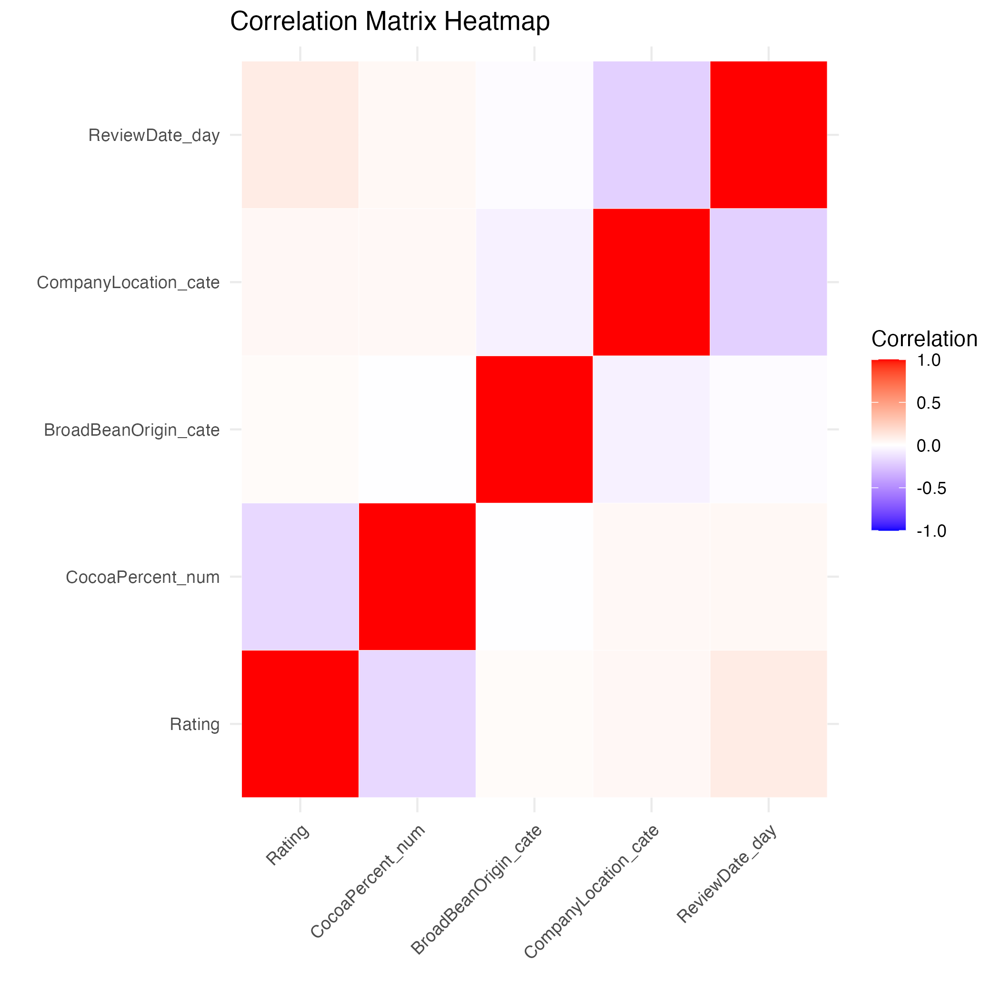
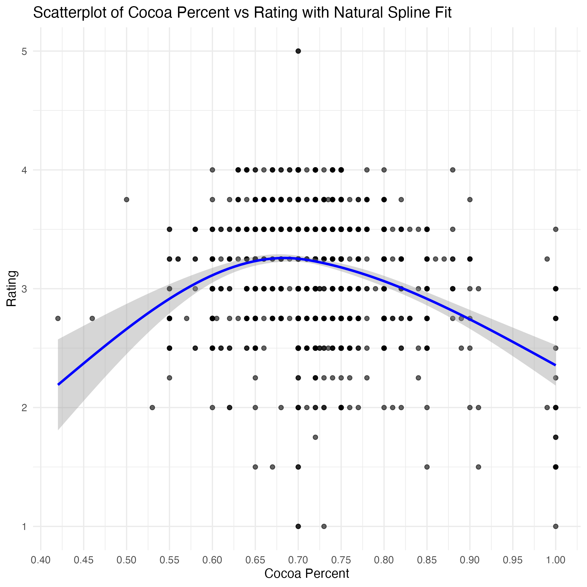
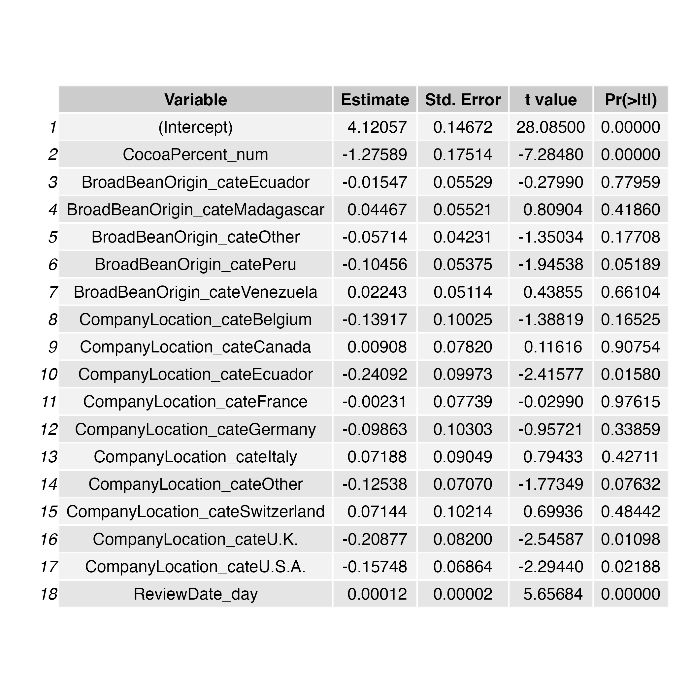

## Data background

The data comes from the "Chocolate Bar Ratings" dataset on Kaggle. It contains expert ratings of over 1700 chocolate bars along with information on their company origin region, percent of cocoa, bean origin region and review date. I'm interested in what factor(s) might influence the expert's rating and what are the similarities and differences between these chocolate bars.

## Data Visualization

In this part, the main features of these chocolate bars will be shown in a graph. 

The ratings of the chocolate bars range from 1 to 5, where 1 is unpleasant and 5 is elite. Only two chocolate bars from the Italian brand "Amedei" received full points and most of the bars were in the range of 2.5 to 3.5.

The majority of these bars are 65% to 75% cocoa, while about 1/3 of the bars are exactly 70% cocoa.

The top 5 countries of origin for beans are, as expected, Venezuela, Ecuador, Peru, Madagascar and the Dominican Republic.

Top 10 countries of origin for brands are given below, US has over 1/3 of these brands.

The review years range from 2006 to 2017, and it looks like they have more reviews in more recent years.

The correlation heat map shows there might be some correlation between cocoa percent and ratings.

Since the association is not linear, I use natural cubic spline to caputure the non-linear trend of the association. It looks like rating peaks at around 70 percent of Cocoa. 

##  Model

After an initial understanding of the data, after model selection, I fit the linear model to find the complex relationship between ratings and cocoa percentage, bean origin, company location, and audit date. The results are as follows. Specifically, the association between ratings and cocoa percentage, review date are significant. Experts tend to give higher ratings to those bars with lower cocoa percentage or later review date. And bean origin does not seem to be significantly associated with ratings. While experts do not seem to like bars from Ecuador, UK and US companies.

On the other hand, the adjusted r-squared of this linear model is small, indicating a lack of variance explanation. I tried other models like LASSO, Random Forest and GAM, none of them works well. So I decided to keep using the linear model to explain the possible association.

## Findings

The analysis reveals that most chocolate bars are made with 70% cocoa, aligning with the finding that bars with around 70% cocoa tend to receive higher ratings from experts. Ratings are influenced by cocoa percentage and review year, with higher ratings associated with later reviews and slightly lower cocoa percentages. While bean origin does not show a significant impact, experts seem less favorable toward bars from companies in Ecuador, the UK, and the US. These trends suggest that both the choice of cocoa content and brand location play a role in shaping expert preferences.

